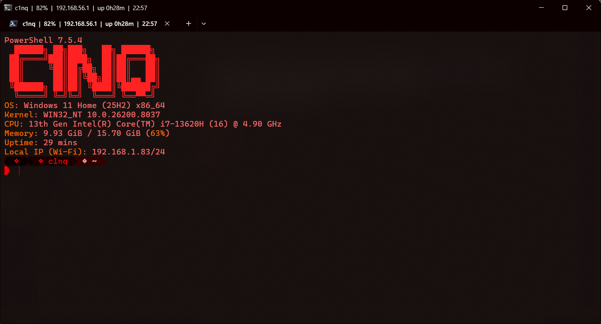
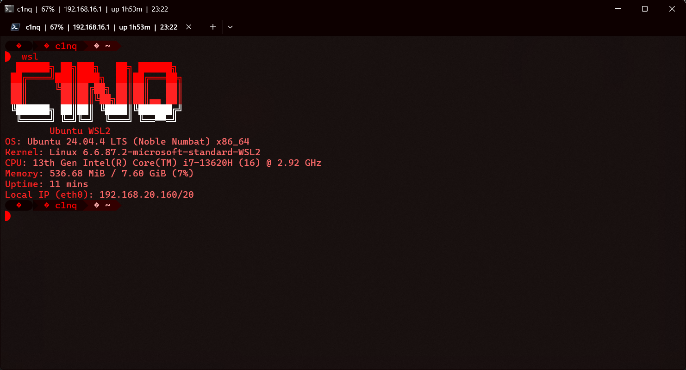
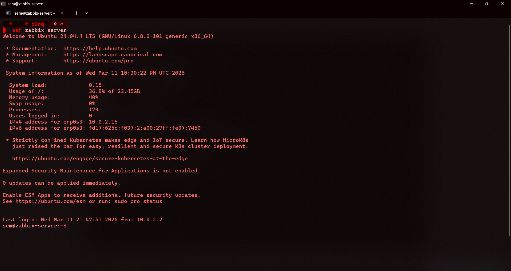

# C1NQ - Projecten

Persoonlijke homelab en engineering projecten.

---

## Terminal Setup
Persoonlijke PowerShell 7 terminal met Oh My Posh, FastFetch en custom rood thema.

---

## WSL2 - Ubuntu
Ubuntu WSL2 setup gesynchroniseerd met Windows terminal.

---

## SSH Config
SSH key authenticatie en config voor servers zonder wachtwoord.

---

## Contact
- GitHub: [c1nq](https://github.com/c1nq)
- Email: c1nqict@gmail.com
