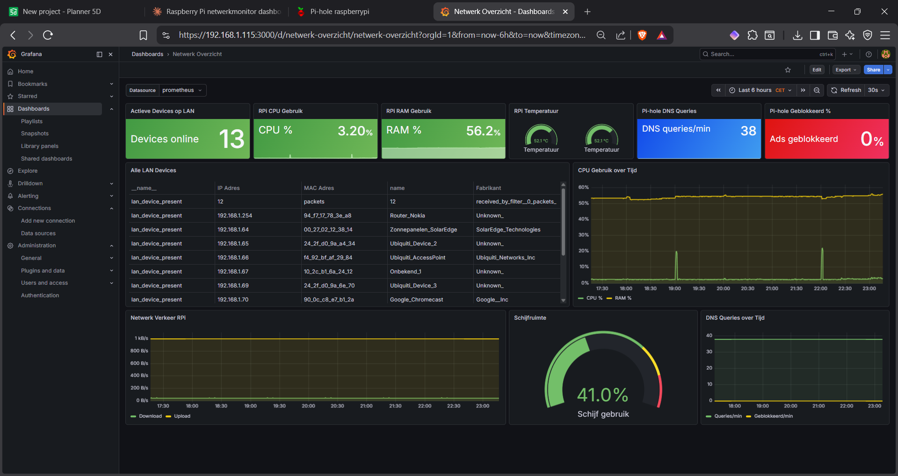

# c1nq - Projecten
Persoonlijke homelab en engineering projecten.

---

## RPi Netwerk Monitor
Complete netwerk monitoring en beveiligingsserver op een Raspberry Pi 4. Pi-hole, Grafana, Suricata IDS, Tailscale VPN en Discord integratie. Veiligheidsscore van 2 naar 9 op 10.

---

## Terminal Setup
Persoonlijke PowerShell 7 terminal met Oh My Posh, FastFetch en custom rood thema.

---

## WSL2 - Ubuntu
Ubuntu WSL2 setup gesynchroniseerd met Windows terminal.

---

## SSH Config
SSH key authenticatie en config voor servers zonder wachtwoord.

---

## User Management Tool
PowerShell script voor het beheren van lokale Windows gebruikers met logging en rapportage.

---

## System Health Check
PowerShell script voor automatische gezondheidscontrole — CPU, RAM, schijf, services en netwerk.

---

## Backup Script
PowerShell script voor automatisch backuppen van mappen met logging en rotatie.

---

## Network Scanner
PowerShell script dat razendsnel het netwerk scant — hostname, MAC adres en ping tijd per apparaat.

---

## Contact
- GitHub: [c1nq](https://github.com/c1nq)
- Email: c1nqict@gmail.com
