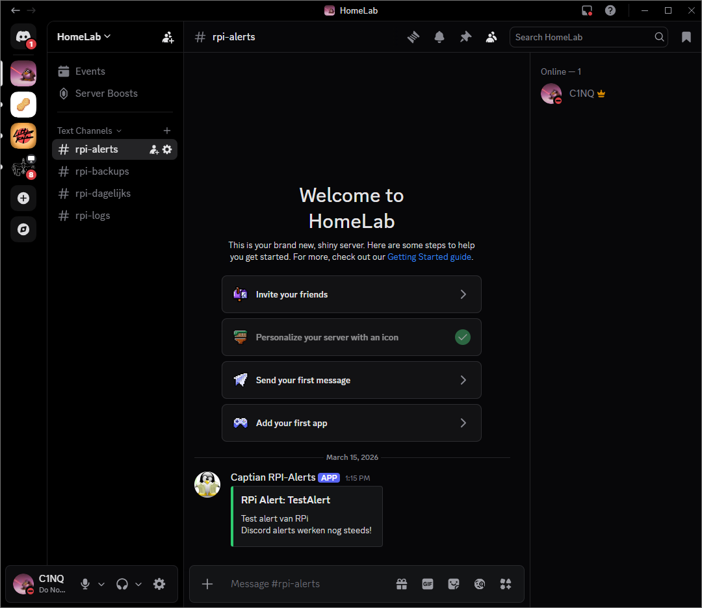
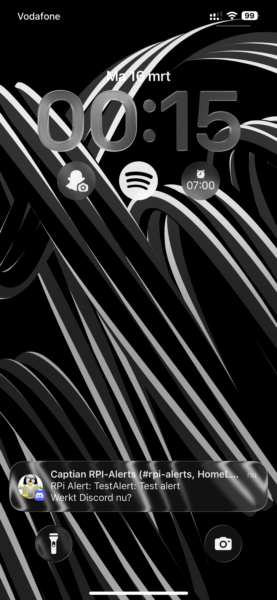

# RPi Netwerk Monitor

Een complete netwerk monitoring en beveiligingsserver gebouwd op een Raspberry Pi 4 voor het thuisnetwerk.

## Wat doet het?

- **Pi-hole** blokkeert 415.000+ advertentie en malware domeinen voor alle apparaten thuis tegelijk
- **Grafana** dashboard met realtime data over CPU, temperatuur, alle apparaten op het netwerk en netwerkverkeer
- **Suricata IDS** analyseert elk pakketje op het netwerk met 49.000+ aanvalspatronen
- **Unbound** versleuteld DNS zodat de provider niet kan zien welke sites je bezoekt
- **Discord** automatische meldingen bij problemen, dagelijkse samenvattingen en nachtelijke backups
- **Tailscale VPN** dashboard bereikbaar van overal ter wereld
- **Fail2ban** bescherming tegen brute force aanvallen

## Stack

| Service | Versie | Functie |
|---------|--------|---------|
| Grafana | 12.4.1 | Dashboard |
| Prometheus | Latest | Metrics database |
| Pi-hole | 2026.02.0 | DNS filter |
| Unbound | 1.22.0 | DNS resolver |
| Node Exporter | Latest | RPi statistieken |
| Blackbox Exporter | Latest | Ping monitoring |
| Speedtest Tracker | Latest | WAN snelheidstest |
| Alertmanager | 0.31.1 | Alert verwerking |
| Suricata | 7.0.10 | Inbraakdetectie |
| Tailscale | 1.94.2 | VPN |

## Veiligheidsscore

Voor: 2/10 — na: 9/10

## Screenshots

## Hardware

- Raspberry Pi 4 Model B Rev 1.4
- Debian GNU/Linux 13 Trixie (64-bit)

## Installatie

Zie de configuratiebestanden in deze repository. Vervang alle `your-password-here` en `YOUR_DISCORD_WEBHOOK_URL` placeholders met je eigen waarden.

## Auteur

Sem Enkelmans — Vista College System Engineer Niveau 4