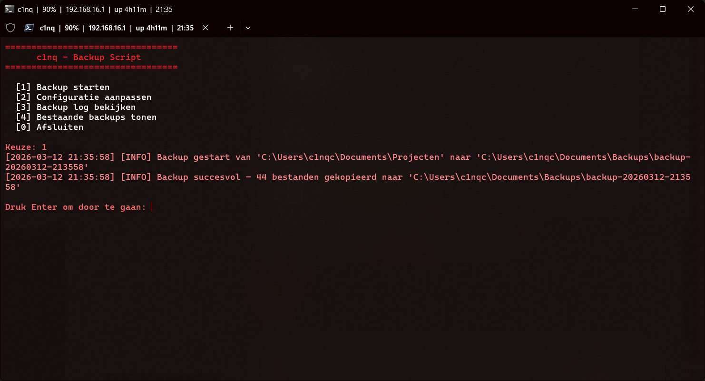

# Backup Script

PowerShell script voor automatisch backuppen van mappen met logging en rotatie.

## Features
- Bronmap en doelmap configureerbaar
- Automatische rotatie — oude backups worden verwijderd
- Voortgangsbalk tijdens backup
- Logging van alle acties
- Bestaande backups bekijken

## Gebruik
Uitvoeren als Administrator:
```powershell
.\Start-Backup.ps1
```

## Preview

