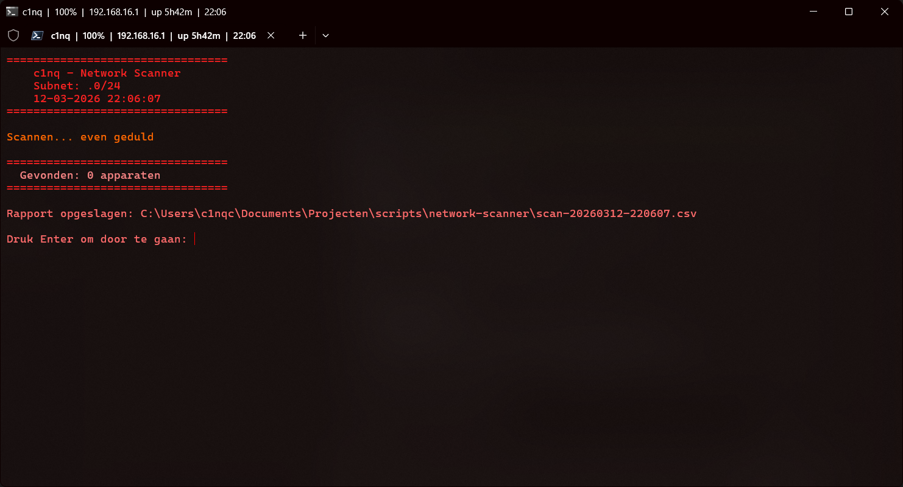

# Network Scanner

PowerShell script dat razendsnel het netwerk scant via parallelle pings.

## Features
- Automatisch eigen subnet detecteren
- 254 IPs tegelijk scannen via parallelle pings
- Hostname, MAC adres en ping tijd per apparaat
- Rapport exporteren als CSV
- Logging van alle scans

## Gebruik
Uitvoeren als Administrator:
```powershell
.\Start-NetworkScan.ps1
```

## Preview

